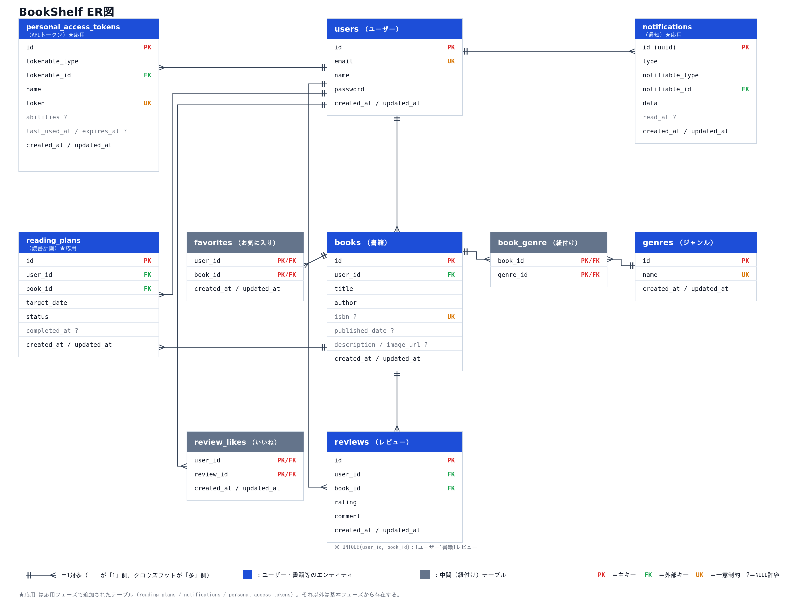

# BookShelf 書籍レビューアプリ

## 概要

書籍を登録し、ユーザー同士でレビュー・評価を共有できる書籍レビューアプリです。
COACHTECH の模擬案件として、曖昧な要件から仕様を設計し、PM（コーチ）と詳細を詰めながらバックエンドを実装しました（Blade テンプレートは支給品を使用）。

### 実装した機能

**基本機能**

- 会員登録・ログイン・ログアウト（Laravel Fortify）
- 書籍の一覧（10件/ページ・新しい順）・詳細・登録・編集・削除（編集・削除は登録者本人のみ）
- ジャンルの一覧（書籍数付き）・詳細・登録・編集・削除（書籍が紐づくジャンルは削除不可）
- レビューの投稿・編集・削除（1ユーザーにつき1書籍1レビュー、編集・削除は投稿者本人のみ）
- お気に入り登録/解除とお気に入り一覧、レビューへのいいね
- 評価ランキング（平均評価 TOP10）
- 公開 API（書籍の一覧・詳細・登録・更新・削除）

**応用機能**

- 書籍一覧のキーワード検索・ジャンル絞り込み・並び替え（検索条件をページネーションに引き継ぐ）
- ISBN 検索による書籍情報の自動入力（Google Books API）
- マイ読書レポート（評価分布・高評価書籍 TOP5・ジャンル別評価傾向 TOP5）
- 読書計画（作成・編集・削除・読了、状態による絞り込み）
- 日次バッチによる読書計画の自動失効とリマインダー通知、通知一覧・既読化
- 公開 API 書き込み系への Sanctum トークン認証

## 使用技術

| 分類 | 技術 |
|---|---|
| 言語 / フレームワーク | PHP 8.5 / Laravel 10.x |
| データベース | MySQL 8.4 |
| 開発環境 | Docker / Laravel Sail / phpMyAdmin |
| 認証 | Laravel Fortify（Web）/ Laravel Sanctum（API） |
| フロントエンド | Blade / Vite / Tailwind CSS 3.4 / @tailwindcss/forms / Alpine.js |
| 外部 API | Google Books API |
| テスト / 整形 | PHPUnit / Laravel Pint |

## ER図



## 環境構築手順

### 1. リポジトリをクローン

```bash
git clone git@github.com:kinaco1225/bookshelf-app.git
cd bookshelf-app
```

### 2. Composer パッケージのインストール

```bash
docker run --rm -u "$(id -u):$(id -g)" -v "$(pwd):/var/www/html" -w /var/www/html -e COMPOSER_CACHE_DIR=/tmp/composer_cache laravelsail/php82-composer:latest composer install
```

### 3. .env ファイルの作成

```bash
cp .env.example .env
```

`.env` のデータベース接続情報を以下に書き換えてください。

```env
DB_CONNECTION=mysql
DB_HOST=mysql
DB_PORT=3306
DB_DATABASE=laravel
DB_USERNAME=sail
DB_PASSWORD=password
```

> `DB_HOST` は `localhost` や `127.0.0.1` ではなく、Docker コンテナ名の `mysql` を指定します。

ISBN 検索（Google Books API）を使う場合は、API キーも設定してください。

```env
GOOGLE_BOOKS_API_KEY=取得したAPIキー
```

> API キーなしでも動作しますが、Google の共有の利用枠を使うため、上限（429 エラー）に達して「書籍情報の取得に失敗しました」と表示されることがあります。
> API キーは [Google Cloud コンソール](https://console.cloud.google.com/) で Books API を有効にし、「API とサービス」→「認証情報」から発行できます（無料）。

> **ISBN 検索の動作確認について**
> 2026年10月時点で、API キーを設定した状態でも、Google Books API の `isbn:` 検索が 0 件を返す事象を確認しています（応答は 200。Google Books 側に ISBN が登録されている書籍でも 0 件）。この場合、画面には「該当する書籍が見つかりませんでした」と表示されます。
> 書籍情報の取得・整形とエラー時のレスポンス（401 / 422 / 404 / 502）は、Google Books API の応答を模擬した `tests/Feature/BookIsbnSearchTest.php` で検証しています（`sail artisan test --filter=BookIsbnSearchTest`）。

### 4. Sail の起動

```bash
./vendor/bin/sail up -d
```

以降は、エイリアスを設定すると `sail` だけでコマンドを実行できます。

```bash
echo "alias sail='[ -f sail ] && bash sail || bash vendor/bin/sail'" >> ~/.zshrc
exec $SHELL
```

> Apple Silicon の Mac で `no matching manifest for linux/arm64/v8` エラーが出る場合は、`compose.yaml` の `mysql` サービスに `platform: 'linux/amd64'` を追加してください。

### 5. アプリケーションキーの生成

```bash
sail artisan key:generate
```

### 6. マイグレーションと初期データの投入

```bash
sail artisan migrate --seed
```

データベースをリセットしたい場合は `sail artisan migrate:fresh --seed` を実行してください。

### 7. フロントエンドのセットアップ

```bash
sail npm install
sail npm run build
```

> 開発中に Blade や CSS を変更する場合は、`sail npm run build` の代わりに `sail npm run dev` を実行したままにしてください。

## 開発環境 URL

| 用途 | URL |
|---|---|
| アプリケーション | http://localhost |
| phpMyAdmin | http://localhost:8080 |

## テスト用アカウント

シーダーで以下の5ユーザーが作成されます（パスワードはすべて `password`）。

| 名前 | メールアドレス |
|---|---|
| 山田太郎 | yamada@example.com |
| 鈴木花子 | suzuki@example.com |
| 田中一郎 | tanaka@example.com |
| 佐藤美咲 | sato@example.com |
| 高橋健太 | takahashi@example.com |

読書計画の主な確認用データは山田太郎に集約しています。鈴木花子の読書計画は、他ユーザーの計画を編集できないこと（403）の確認用です。

## API エンドポイント一覧

全エンドポイント共通で `Accept: application/json` ヘッダーを付けてください。

| メソッド | パス | 概要 | 認証 |
|---|---|---|---|
| GET | /api/v1/books | 書籍一覧を取得する（`keyword` / `genre_id` / `page` / `per_page` で検索・絞り込み） | 不要 |
| GET | /api/v1/books/{book} | 書籍詳細を取得する（ジャンル・レビューを含む） | 不要 |
| POST | /api/v1/books | 書籍を新規登録する | Sanctum |
| PUT | /api/v1/books/{book} | 書籍を更新する | Sanctum（登録者本人のみ） |
| DELETE | /api/v1/books/{book} | 書籍を削除する | Sanctum（登録者本人のみ） |

### API トークンの発行

トークン発行用のエンドポイントは用意していません。tinker で発行してください。

```bash
sail artisan tinker
```

```php
App\Models\User::where('email', 'yamada@example.com')->first()->createToken('api')->plainTextToken;
```

発行したトークンを `Authorization: Bearer <トークン>` ヘッダーに付けてリクエストします。

## 読書計画の日次バッチ

Console Command（`reading-plans:process`）として実装し、Laravel の Schedule に毎日 20:00 実行で登録しています（`app/Console/Kernel.php`）。バッチの内容は以下のとおりです。

- 期日を過ぎた「進行中」の計画を「期限切れ」に変更
- 期日の3日前・当日・3日後にリマインダー通知を送信

### 動作確認（手動実行）

時刻を待たずにすぐ確認できます。

```bash
sail artisan reading-plans:process
```

### Schedule 経由での実行

以下を実行したままにすると、1分ごとに Schedule を確認し、20:00 にバッチが実行されます。

```bash
sail artisan schedule:work
```

本番環境では、cron に以下を登録して1分ごとに `schedule:run` を実行します。

```cron
* * * * * cd /path-to-project && php artisan schedule:run >> /dev/null 2>&1
```

## テスト

```bash
sail artisan test
```

## 作成者

木下 裕哉
